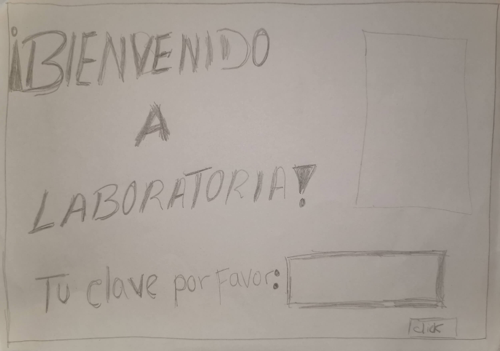
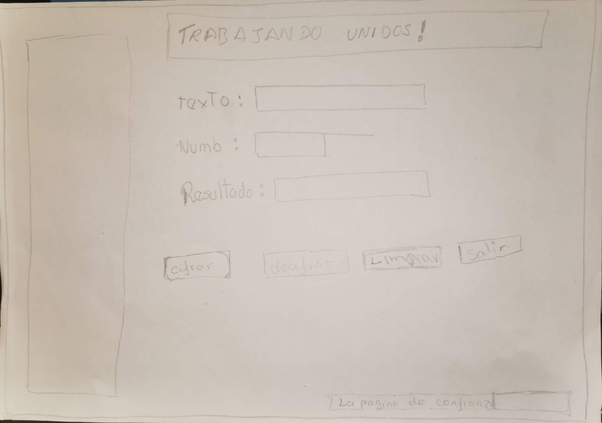
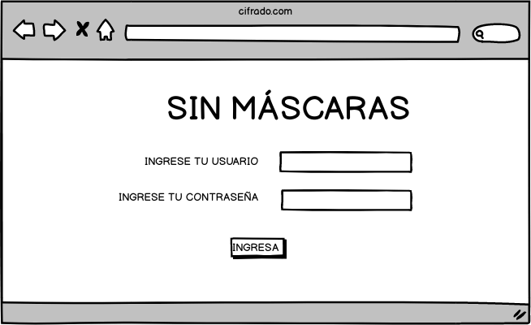
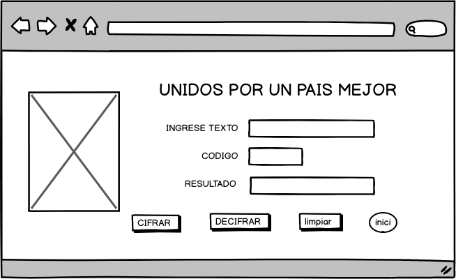

# SIN MASCARAS!

* En los últimos tiempos  las informaciones que recivimos es sobre la corrupción dentro del gobierno, sobre los lavados activos,  y sobre el mal uso de autoridad. Y el Perú mantiene un alto índice de percepción de corrupción ubicándose en el puesto 105 de 180 naciones . 

+ Devido a esta problemática  decidimos hacer una pagina donde podamos denunciar y ser parte del cambio.

 ## LOS USUARIOS SON :
 
* Las personas que estan dentro del gobierno  y quiere  luchar contra toda corrupcion,  tengan la facilidad  de denunciar sin tener que hacer largas colas, horas de espera y sobre todo con la seguridad que su vida no corre peligro ni la de su familia.

* A los policias darles mayor facilidad en su trabajo , y  ayudarles a que encuentren a las personas que realmente son culpables .

## OBJETIVO

+ Esta pagina  proporciona al usuario una mayor seguridad al poder hacer las denuncias a traves de un metodo de cifrado  que se realiza para poder tener la seguridad que nadie tendra acceso a  la información. Y que las autoridades policiales puedan cifrar y decifrar el texto indicado en un desplazamiento específico de caractes(offset) .

## PASOS PARA USAR LA APLICACIÓN:

1. Entra a la pagina SIN MÁSCARAS.
2. Escribir tu usuario.
3. Escribir tu contraseña.

## CIFRAR
1. Escribe tu denuncia en el recuadro donde dice texto.
2. Escribe el número de desplazamiento (offset).
3.Preciona el botón cifrar.

## DECIFRAR
1. Escribe tu denuncia cifrada en el recuadro dende dice texto.
2. Escribe tu número de desplazamieto(offset).
3. Preciona el botón decifrar.

 

## MEJORANDO

* Mejore la primera pantalla mostrando el nombre del proyecto  al  recibir feedback de la coache, tambien pude notar que seria muy bueno agregar el nombre del usuario.
* Mejore el titulo de la segunda pagina, haciendo que el titulo sea mas amigable al usuario, y el nombre del texto para que tenga mayor comprención.Fue con el feedback de mi compañera.

 